# Mindcraft: Text-Conditioned Infinite Worlds

What if you could get an infinite Minecraft world just from a prompt? Mindcraft is an experiment in fast, infinite world generation.

Want to see how it works? Check out my article [here](https://medium.com/@sophia.p.zhang/mindcraft-text-conditioned-infinite-worlds-c5530e4a862b)!
As of now, Mindcraft can only generate prompts that are feasible natural biomes in Minecraft 1.21.11.

## Examples

Each clip is gameplay of worlds generated by inputting a certain prompt.

<table>
  <tr>
    <td width="33%" valign="top">
      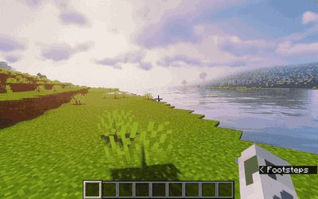
      <br/><em>A Minecraft world of endless rolling plains with a wide, slow river cutting a shallow valley through the middle.</em>
    </td>
    <td width="33%" valign="top">
      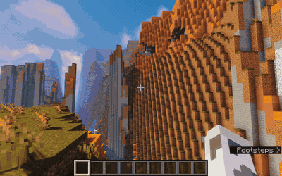
      <br/><em>A Minecraft world of layered desert mesas carved by erosion into grand canyon-like formations with a thin river at the bottom.</em>
    </td>
    <td width="33%" valign="top">
      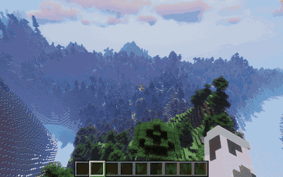
      <br/><em>A Minecraft world of high, snowy mountains with sharp peaks, with forest-covered foothills below.</em>
    </td>
  </tr>
  <tr>
    <td valign="top">
      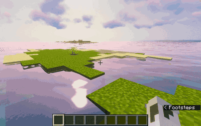
      <br/><em>A Minecraft world of open ocean with a long, low sandy tropical archipelago of flat islands just barely above sea level.</em>
    </td>
    <td valign="top">
      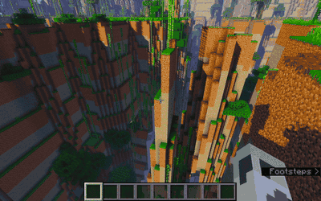
      <br/><em>A Minecraft world of jungle cliffs with rivers and sharp cliff drops.</em>
    </td>
    <td valign="top">
      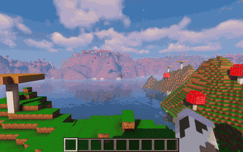
      <br/><em>A Minecraft world of giant mushroom islands surrounded by warm tropical seas.</em>
    </td>
  </tr>
  <tr>
    <td valign="top">
      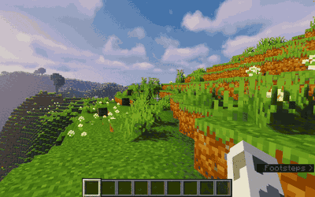
      <br/><em>A Minecraft world of beautiful flower-filled meadows abruptly changing into swamps.</em>
    </td>
    <td valign="top">
      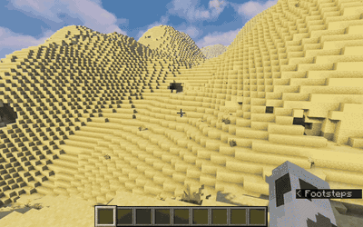
      <br/><em>A Minecraft world of sand dunes and tall desert mountains and blazing heat, like the Sahara desert.</em>
    </td>
    <td valign="top">
      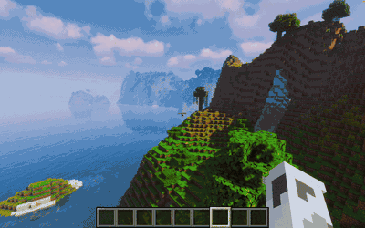
      <br/><em>A Minecraft world that looks like La Jolla in San Diego.</em>
    </td>
  </tr>
</table>

## Try it out!

### 1. Requirements

- No hardware requirements -- if your computer can run vanilla Minecraft, it can run Mindcraft!
- **Minecraft: Java Edition `1.21.11`** (I built this mod for this version specifically)
- **Java 21**

### 2. Install Fabric

Mindcraft is a [Fabric](https://fabricmc.net/) mod and needs both the loader and the Fabric API:

1. Download and run the **[Fabric Loader installer](https://fabricmc.net/use/installer/)**. In the
   installer, choose Minecraft version **1.21.11** and click _Install_.
2. Download the **[Fabric API](https://modrinth.com/mod/fabric-api)** mod — get the file for
   **1.21.11**.

### 3. Install Mindcraft

1. Download the latest **`mindcraft-*.jar`** from the
   [Releases page](https://github.com/soapantelope/mindcraft/releases).
2. Open your Minecraft **`mods`** folder:
   - **Windows:** `%appdata%\.minecraft\mods`
   - **macOS:** `~/Library/Application Support/minecraft/mods`
   - **Linux:** `~/.minecraft/mods`
   - (Create the `mods` folder if it doesn't exist.)
3. Drag **both** `fabric-api-*.jar` and `mindcraft-*.jar` into that `mods` folder.

I also recommend playing with shaders, it makes the worlds look a lot prettier :)

### 4. Launch

1. In the Minecraft Launcher, select the **`fabric-loader-1.21.11`** profile and press play.
2. Create a new world. Go to the world settings in the world creation screen, and click on
   World Type until you reach the Mindcraft world type. Press "customize", write your prompt,
   press "Generate", then press "Create New World".

<table>
  <tr>
    <td width="25%" valign="top">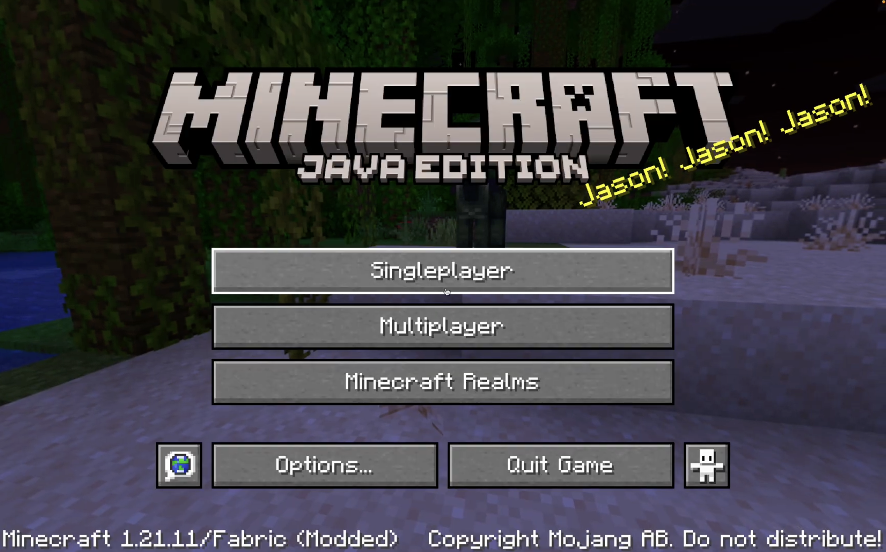</td>
    <td width="25%" valign="top">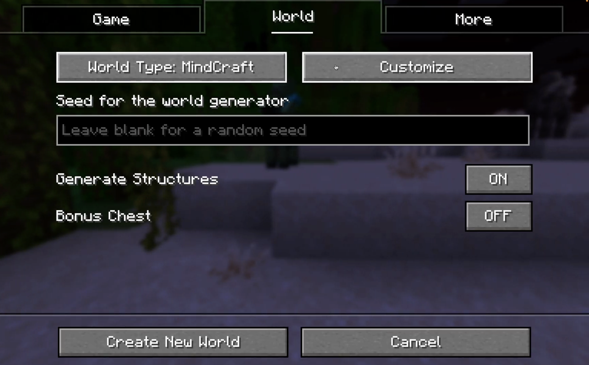</td>
    <td width="25%" valign="top">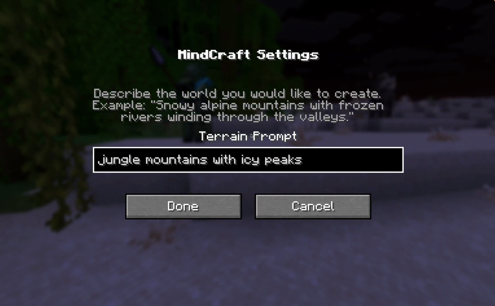</td>
    <td width="25%" valign="top">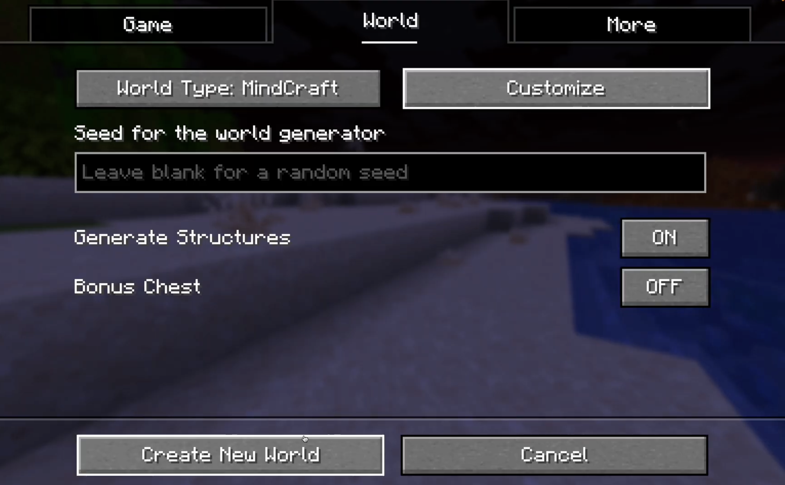</td>
  </tr>
</table>
3. Explore!

## API key (no setup needed)

Generating a world calls an LLM. **You don't need your own API key**. By default the mod routes
requests through a shared, rate-limited proxy, so it works out of the box. (Limits apply to keep it
fair; if you hit them, just try again later.)

There is a limit of 10 prompts per day, just to keep my wallet OK (I am paying out of pocket for
API costs).

**Want to use your own key instead** (no limits)? Edit the config file that the mod creates on first
run at `<path-to-your-minecraft-folder>/config/mindcraft-anthropic.properties` and set:

```properties
api_key=sk-ant-your-key-here
```

or set the `ANTHROPIC_API_KEY` environment variable. A personal key bypasses the shared proxy.

Please star this repo and share it with friends if you think it's cool! Also, any and all feedback
is greatly appreciated.

This project was initially inspired by [Terrain Diffusion](https://xandergos.github.io/terrain-diffusion/) — please check his project out too!
